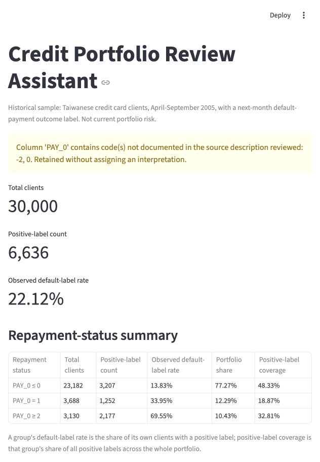
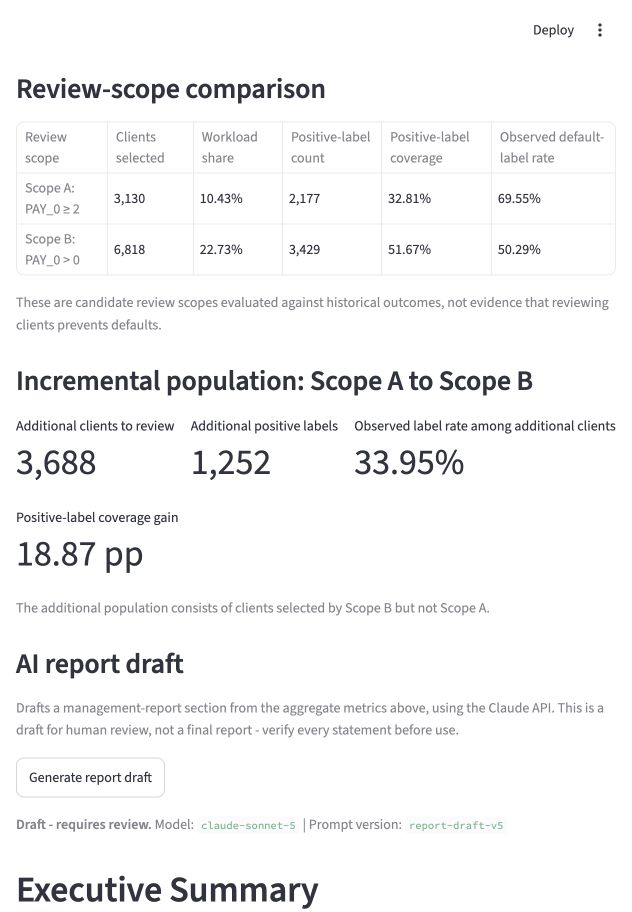
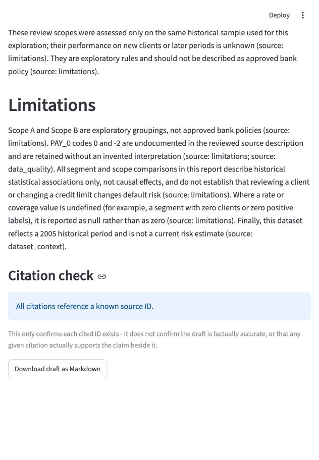

# Credit Portfolio Review Assistant

## Business question

How do observed next-month default-label rates vary across customer segments, and how does expanding a candidate review scope change workload and historical default coverage?

## Completed analysis

- Data quality checks and portfolio baseline analysis.
- Repayment-status segmentation and credit-limit stratified analysis.
- Candidate review-scope comparison and incremental workload analysis.
- Reconciliation assertions and an English management report.

The notebook's calculations call the shared `core/` modules (`core/metrics.py`,
`core/validator.py`, `core/review_scopes.py`) instead of duplicating the logic
inline, so the notebook and the Streamlit application (`app/main.py`, see
[AI report drafting application](#ai-report-drafting-application) below)
share one implementation. These modules are covered by the automated tests
in `tests/` (run with `python -m pytest` from the repository root).

| Scope | Clients selected | Positive labels selected | Historical positive-label coverage |
| --- | ---: | ---: | ---: |
| PAY_0 >= 2 | 3,130 | 2,177 | 32.81% |
| PAY_0 > 0 | 6,818 | 3,429 | 51.67% |

Expanding the scope selects 3,688 additional clients and 1,252 additional positive labels. The overall sample contains 30,000 clients and 6,636 positive labels (22.12%).

## Application screenshots

Captured from the running application using the historical sample and an existing AI draft, without a new API call.

### Portfolio overview

Data-quality warnings, 30,000 clients, and the 22.12% baseline provide context for repayment-status comparisons.



### Review-scope comparison

Scope B adds 3,688 clients and 18.87 percentage points of historical positive-label coverage relative to Scope A. These exploratory comparisons describe workload and coverage, not defaults prevented.



### AI draft and citation review

Generates report drafts from calculated portfolio summaries, checks source IDs, and supports Markdown export. Drafts require human review before use.



## Deliverables

- [Analysis notebook](analysis/notebooks/credit-card-portfolio-risk-review.ipynb)
- [Management report](analysis/reports/management-report-en.pdf)

## Data and notebook usage

The full 30,000-client dataset is included in `data/UCI_Credit_Card.csv`.

From the repository root (Python 3.11 or newer):

```bash
python3 -m venv .venv
source .venv/bin/activate
python -m pip install -r requirements.txt
python -m jupyterlab analysis/notebooks/credit-card-portfolio-risk-review.ipynb
```

On Windows, activate with `.venv\Scripts\activate` instead. Select the environment's Python kernel and use **Restart Kernel and Run All Cells**. The notebook locates the bundled data from the repository root or any subdirectory.

The data describes Taiwanese clients with April–September 2005 history and a next-month outcome label. The PDF is the previously delivered report; refreshed notebook outputs are generated from the bundled CSV.

Verified on 2026-09-12 using Python 3.11 and the pinned dependencies: all 23 code cells executed from a fresh kernel, both charts rendered, and reconciliation checks passed, matching the results before the notebook was refactored to call the shared `core/` modules. The data loader and `core/` imports were checked from both the repository root and the notebook directory.

## AI report drafting application

`app/main.py` is a Streamlit page that loads the bundled dataset, runs the
same data-quality validation and portfolio/segment/review-scope analysis as
the notebook (via `core/metrics.py`, `core/validator.py`,
`core/review_scopes.py`), and adds an "AI report draft" section (FR-04).

Start it from the repository root, with the virtual environment active:

```bash
streamlit run app/main.py
```

Clicking "Generate report draft" builds an aggregate-only JSON context
(`app/report_context.py`'s `build_report_context()` — no individual client
rows or IDs) and sends it to Claude via `app/assistant.py`'s
`generate_report_draft()`. This requires `ANTHROPIC_API_KEY` and
`ANTHROPIC_MODEL` to be configured (see
[Claude API configuration](#claude-api-configuration) below); otherwise the
page shows an inline notice and the button is not displayed.

### Citation validation

Source IDs are checked offline. Invalid or missing citations block Markdown export. A passing check confirms source-ID validity, not factual accuracy or whether a citation supports a claim; drafts require human review.

## Claude API configuration

Report generation (see `SPECS.md` FR-04) calls Claude through the official
`anthropic` Python SDK, included in `requirements.txt` alongside
`python-dotenv` for explicit `.env` loading.

### Setup

1. Copy the example environment file (never commit `.env`; it is already
   listed in `.gitignore`):

   ```bash
   cp .env.example .env
   ```

2. Edit `.env` and set:
   - `ANTHROPIC_API_KEY` — your Anthropic API key.
   - `ANTHROPIC_MODEL` — the model ID to use (for example `claude-opus-5`).

### Verify connectivity

With the virtual environment active and dependencies installed, run:

```bash
python scripts/check_claude_api.py
```

